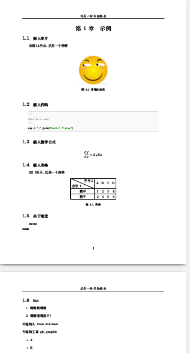

## 来自北京邮电大学的latex模板

* 改编自武汉大学的模板,也借鉴了浙大的模板的一些东西
* 不是官方模板, 适用于格式要求不强的实验报告等

### 使用方法

* 执行`xelatex thesis.tex` 不报错即正常, 输出文件为`thesis.pdf`
* 当然你需要安装texlive才行, 我安装的2017版本的, 可能安装不会太轻松, 但是值得.

#### 说明
* **原则1**　文字，代码，图片相互分离
* **原则2**　将常用命令进行封装和固化, 减少代码量.
* **封面** 一般都是学校给定的, 将封面的pdf格式放到cover/cover.pdf就可以,默认取第一页当作封面.通过`thesis.tex`中的`\includepdf[page=1]{cover/cover}`实现, 如果不需要封面将其注释.
* **代码** 通过我的自定义命令`\addcode[python]{main.py}`来插入代码块, 其中`main.py`放在`code`文件夹中
* **图片** 通过我的自定义命令`\addfig[0.3]{logo.jpg}{fig:logo}{滑稽的基类}` 这四个参数分别为: 图宽与页宽之比, 图片名称, 调用代号, 配字, 图片要放在`figure`中
* **数学公式** 可以在[这里](https://zh.numberempire.com/latexequationeditor.php)快速生成公式代码
* **工程结构** 
	* `thesis.tex` 主文件, 最高层
	* `preset.tex` 定义配置
	* 'body/abstract.tex' 章节
	* 'body/chapter0.tex' 摘要 
	* 'body/bib.tex' 参考文献
	* `code/*` 代码文件
	* `figure/*` 图片文件
	* `cover/cover.pdf` 封面文件


#### 几个栗子
```latex

\pagenumbering{arabic}

\section{示例}

\subsection{插入图片}
如图\ref{fig:logo}所示,这是一个滑稽\\
%插入图片[图片宽度/页宽]{path}{label}{caption}
\addfig[0.2]{logo.jpg}{fig:logo}{滑稽的基类}

\subsection{插入代码}
\addcode[python]{code.py}

\subsection{插入数学公式}
%https://zh.numberempire.com/latexequationeditor.php, 在这个网站上生成公式代码
$$ \frac{\partial f}{\partial x} = 2\,\sqrt{a}\,x $$

\subsection{插入表格}
如\ref{table}所示, 这是一个表格
\input{body/ch0_table}

\subsection{关于缩进}
\indent \textbf{xxxx}\\
\noindent xxxx

\subsection{list}
\begin{enumerate}
	\item  啊啊啊啊啊
	\item  嗯嗯嗯嗯恩???
\end{enumerate}
\begin{description}
  \item[牛逼的人] linus, stallman 
  \item[牛逼的工具] git, gnuplot
\end{description}
\begin{itemize}
	\item A
	\item B
\end{itemize}

```
效果如下  

